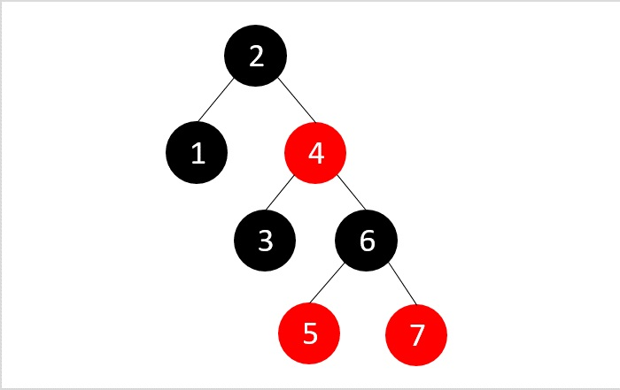
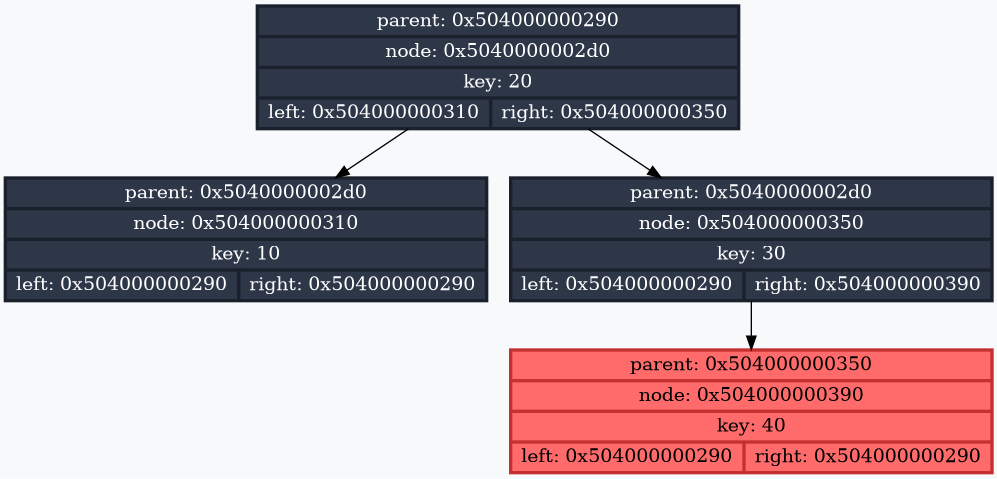

# Red-Black Tree

## Overview

This project implements a Red-Black Tree data structure in C++. A Red-Black Tree is a self-balancing binary search tree that ensures O(log n) time complexity for various operations. This implementation focuses on insertion, range queries, and iterator support, with comprehensive testing using end-to-end and unit tests.

## Theoretical Background on Red-Black Trees

A Red-Black Tree is a type of self-balancing binary search tree where each node has an extra attribute, a color (red or black), to maintain balance.

<div align="center">

</div>

The tree adheres to the following properties:

1. **Node Color**: Every node is either red or black.

2. **Root Property**: The root node is always black.

3. **Leaf Property**: All leaf nodes (NIL nodes) are black.

4. **Red Property**: No two red nodes can be adjacent (i.e., a red node cannot have a red parent or child).

5. **Black Depth Property**: Every path from a node to its descendant leaves contains the same number of black nodes.

## Features

- **Insertion**: Add nodes to the tree while maintaining Red-Black Tree properties.

- **Range Query**: Support for lower_bound and upper_bound operations using iterators.

- **Iterators**: Provide begin() and end() iterators for tree traversal.

- **Self-Balancing**: Maintains balance through left and right rotations and color adjustments.

- **Visualization**: Dump the tree structure to a Graphviz file for debugging.


## Requirements

- C++11 or later

- A C++ compiler (e.g., g++, clang++)

- CMake

- Graphviz (optional, for visualizing the tree)

- Python3 (optional, for e2e testing)

## Installing and Running

```bash
git clone https://github.com/lavrt/RedBlackTree
cd RedBlackTree

cmake -B build -S . -DCMAKE_BUILD_TYPE=Release
cmake --build build

./build/tree            # running the main application

cd build && ctest       # running unit tests

cd RedBlackTree && python3 tests/e2e/run_e2e.py     # running e2e tests
```

## Visualization

The Red-Black Tree supports visualization.

<div align="center">

</div>

To convert the generated DOT files to PNG images:
1. Install Graphviz (if not already installed)
2. Run your program (the .gv files are generated automatically when you call ```tree.Dump("filename")```)
3. Convert to PNG using the dot command:
```bash
dot filename.gv -Tpng -o filename.png
```